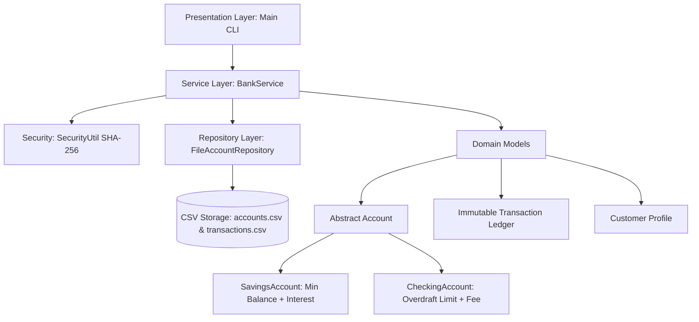

# 🏦 Banking & Transaction Simulation System

[](https://www.oracle.com/java/)
[](https://github.com/)
[](https://github.com/)
[](run_tests.bat)
[](report/Banking_System_Project_Report.pdf)

A complete, production-grade **Banking and Transaction Simulation System** implemented in pure **Core Java**. Designed specifically for university and college computer science courses, object-oriented programming (OOP) evaluations, and viva presentations.

Includes zero-dependency CSV persistence, atomic inter-account fund transfers with rollback, salted SHA-256 cryptographic security, customer & bank manager portals, an automated test runner, and a **13-page ready-to-submit Academic Project Report PDF**.

---

## 📑 Table of Contents
- [Project Highlights](#-project-highlights)
- [System Architecture & OOP Design](#-system-architecture--oop-design)
- [Account Tiers Comparison](#-account-tiers-comparison)
- [Transaction Safety & Atomicity](#-transaction-safety--atomicity)
- [Project Directory Structure](#-project-directory-structure)
- [Getting Started & Quick Launch](#-getting-started--quick-launch)
- [Automated Verification & Test Matrix](#-automated-verification--test-matrix)
- [Viva & Demo Presentation Walkthrough](#-viva--demo-presentation-walkthrough)
- [Academic Project Report PDF](#-academic-project-report-pdf)
- [Git & GitHub Commands](#-git--github-commands)
- [Author & License](#-author--license)

---

## 🌟 Project Highlights

- **Pure Java SE (No External Frameworks / Zero Config):** Runs instantly on any machine with JDK 17, 21, or 25. No Maven, Gradle, or external database setups required.
- **Strict Object-Oriented Principles:** Demonstrates Abstraction, Encapsulation, Inheritance, and Polymorphism across modular packages.
- **Fail-Safe Atomic Transfers:** Two-party money transfers adhere to ACID principles. If recipient deposit fails or an error occurs mid-transaction, sender funds are automatically rolled back.
- **Cryptographic PIN Authentication:** User PINs are protected with salted SHA-256 hashing (`MessageDigest`) rather than insecure plaintext storage.
- **Durable File Persistence:** Automatically persists account balances and complete transaction ledgers in human-readable CSV files (`data/accounts.csv` and `data/transactions.csv`).
- **Dual Role Interfaces:**
  - **Customer Portal:** Open accounts, deposit, withdraw, transfer money, and generate statement audit logs.
  - **Bank Manager Portal:** Review bank liquidity reserves, inspect all accounts, freeze/unfreeze accounts, and run batch monthly interest calculations.
- **Automated Regression Suite:** 11 built-in automated test scenarios that verify all financial boundary constraints and edge cases without third-party test libraries.

---

## 🏛 System Architecture & OOP Design

The codebase follows a decoupled 4-tier architectural design pattern:



### OOP Principles in Action
| OOP Principle | Implementation in this Project |
| :--- | :--- |
| **Abstraction** | Base class [`Account`](src/com/bank/model/Account.java) defines abstract contracts `withdraw()` and `getAccountType()`, hiding financial fee and overdraft rules from callers. |
| **Encapsulation** | Sensitive fields (`balance`, `pinHash`, `transactions`) are marked private/protected and manipulated only through validated, synchronized methods. |
| **Inheritance** | [`SavingsAccount`](src/com/bank/model/SavingsAccount.java) and [`CheckingAccount`](src/com/bank/model/CheckingAccount.java) extend [`Account`](src/com/bank/model/Account.java), inheriting common balance, holder, and audit tracking. |
| **Polymorphism** | [`BankService`](src/com/bank/service/BankService.java) treats all accounts polymorphically during transfers, deposits, and statements without needing `instanceof` branching. |

---

## 💳 Account Tiers Comparison

| Feature | Savings Account (`SAVINGS`) | Checking Account (`CHECKING`) |
| :--- | :--- | :--- |
| **Target Audience** | Long-term savers & wealth builders | Daily spenders, payroll & businesses |
| **Minimum Balance** | **$100.00** (enforced on all withdrawals) | None ($0.00) |
| **Overdraft Facility** | Not allowed | Up to **$500.00 credit limit** |
| **Overdraft Fee** | N/A | **$15.00** when balance dips into negative |
| **Interest Rate** | **4.50% p.a.** (monthly accrual simulation) | 0.00% |
| **Exception Thrown** | `InsufficientFundsException` | `OverdraftExceededException` |

---

## 🔄 Transaction Safety & Atomicity

In banking systems, transferring money between two accounts must be **atomic**: either both sides succeed, or neither happens.

```java
// Atomic execution guarantee inside BankService.java
double senderSnapshot = sender.getBalance();
try {
    sender.withdraw(amount, "Transfer to " + recipient.getAccountNumber());
    recipient.deposit(amount, "Transfer from " + sender.getAccountNumber());
    repository.save(sender);
    repository.save(recipient);
} catch (Exception e) {
    // Automatic Rollback
    sender.restoreBalance(senderSnapshot);
    throw new BankingException("Transfer failed and was rolled back: " + e.getMessage(), e);
}
```

---

## 📂 Project Directory Structure

```
java_project/
├── .gitignore                                 # Ignores compiled binaries & temporary test data
├── compile_and_run.bat                        # 1-Click launcher for Windows
├── run_tests.bat                              # 1-Click test runner for Windows
├── README.md                                  # Complete project documentation
├── data/                                      # Persistent CSV storage directory
│   ├── accounts.csv                           # Registered accounts and credentials
│   └── transactions.csv                       # Historical transaction ledgers
├── report/                                    # Academic Project Report Suite
│   ├── report_template.html                   # Print-styled HTML academic report
│   ├── generate_pdf.py                        # Automated PDF compiler script
│   ├── generate_pdf.bat                       # 1-Click PDF recompiler
│   └── Banking_System_Project_Report.pdf      # Compiled 13-page academic report
└── src/
    └── com/bank/
        ├── Main.java                          # Interactive CLI application & menus
        ├── TestRunner.java                    # Standalone automated regression suite
        ├── exception/
        │   ├── BankingException.java          # Base checked financial exception
        │   ├── AccountNotFoundException.java  # Thrown when account query fails
        │   ├── InsufficientFundsException.java# Thrown when minimum balance violated
        │   ├── InvalidPinException.java       # Thrown on invalid PIN authentication
        │   └── OverdraftExceededException.java# Thrown when overdraft credit exceeded
        ├── model/
        │   ├── Account.java                   # Abstract base account class
        │   ├── SavingsAccount.java            # Savings account with interest logic
        │   ├── CheckingAccount.java           # Checking account with overdraft logic
        │   ├── Customer.java                  # Customer metadata entity
        │   ├── Transaction.java               # Immutable audit transaction entity
        │   └── TransactionType.java           # Enum (DEPOSIT, WITHDRAWAL, TRANSFER, etc.)
        ├── repository/
        │   ├── AccountRepository.java         # Data access contract interface
        │   └── FileAccountRepository.java     # CSV file reader/writer & serializer
        └── service/
            ├── BankService.java               # Core transactions, atomic logic, interest
            └── SecurityUtil.java              # Salted SHA-256 PIN hasher
```

---

## 🚀 Getting Started & Quick Launch

### Prerequisites
- Any Java Development Kit (JDK 17, 21, or 25). Verify by running:
  ```powershell
  javac -version
  java -version
  ```

### 1-Click Launch (Windows)
Simply double-click:
```
compile_and_run.bat
```

### Manual Terminal Commands (PowerShell / Command Prompt / Linux / macOS)
```bash
# 1. Create output bin folder
mkdir bin

# 2. Compile all source files
javac -d bin src/com/bank/exception/*.java src/com/bank/model/*.java src/com/bank/repository/*.java src/com/bank/service/*.java src/com/bank/Main.java

# 3. Run the application
java -cp bin com.bank.Main
```

---

## 🧪 Automated Verification & Test Matrix

The project includes an automated test runner ([`TestRunner.java`](src/com/bank/TestRunner.java)) that verifies system integrity in an isolated test environment without disturbing live customer records:

```powershell
java -cp bin com.bank.TestRunner
```
*(Or double click `run_tests.bat`)*

### Verification Results
```
================================================================================
                 BANKING SYSTEM AUTOMATED TEST & VERIFICATION                   
================================================================================
 [PASS] Savings account creation
 [PASS] Checking account creation
 [PASS] Deposit increases balance
 [PASS] Savings min balance enforcement
 [PASS] Checking overdraft with fee
 [PASS] Checking overdraft cap exceeded
 [PASS] Atomic transfer updates both accounts
 [PASS] Transfer rollback restores sender balance
 [PASS] Invalid PIN rejection
 [PASS] Interest accrual calculation
 [PASS] Persistence of account balance and transactions
================================================================================
RESULTS: 11 / 11 tests passed successfully!
>>> ALL TESTS PASSED! System is fully verified and stable. <<<
================================================================================
```

---

## 🎤 Viva & Demo Presentation Walkthrough

Follow this sequence to deliver an impressive demonstration to your professor or examiner:

1. **Demonstrate Pre-Seeded Accounts:**
   - Launch application (`compile_and_run.bat`).
   - Select option `[2]` (Customer Login).
   - Enter Account: `ACC-1001` | PIN: `1234` (Alice Johnson - Savings Account).
   - Show balance (`$1,700.00`).
2. **Demonstrate Minimum Balance Enforcement:**
   - Choose `[3]` (Withdraw).
   - Try to withdraw `$1,650.00` (which would leave $50, below the $100 minimum).
   - Show how `InsufficientFundsException` is thrown and caught with a user-friendly error message.
3. **Demonstrate Inter-Account Atomic Transfer:**
   - Choose `[4]` (Transfer Funds).
   - Transfer `$200.00` to Bob's Checking Account (`ACC-1002`).
   - Log out and log into Bob's account (`ACC-1002`, PIN `4321`) to verify balance increased.
4. **Demonstrate Checking Overdraft & Fee:**
   - In Bob's account, withdraw more than the balance. Show that the transaction succeeds using the overdraft facility and assesses the $15 fee.
5. **Demonstrate Bank Manager Dashboard:**
   - Return to main menu, select `[3]` (Manager Portal).
   - Enter Passcode: `admin123`.
   - Show option `[2]` (Bank Reserves) and `[3]` (Simulate Monthly Interest Accrual across all savings accounts).
6. **Demonstrate Persistence:**
   - Close the application completely.
   - Re-open it and show that all balances and transaction history were preserved in `data/accounts.csv` and `data/transactions.csv`.

---

## 📄 Academic Project Report PDF

A complete, 13-page academic report is pre-compiled at:
[`report/Banking_System_Project_Report.pdf`](report/Banking_System_Project_Report.pdf)

### Report Structure:
1. Formal University Cover Sheet & Title Page
2. Certificate of Originality & Acknowledgements
3. Table of Contents
4. Chapter 1: Introduction, Problem Statement & Objectives
5. Chapter 2: Hardware & Software Requirements, Tech Stack Rationale
6. Chapter 3: System Architecture & Detailed OOP Principles
7. Chapter 4: Implementation Details & Financial Safety Algorithms
8. Chapter 5: Test Execution Matrix & Automated Results
9. Chapter 6: User Interface Transcripts & Terminal Logs
10. Chapter 7: Conclusion & Future Scope

### Customizing the Report with Your Details:
1. Open [`report/report_template.html`](report/report_template.html) in any text editor.
2. Edit `[Student Name]`, `[Roll Number]`, and `[College / University Name]`.
3. Double-click [`report/generate_pdf.bat`](report/generate_pdf.bat) (or run `python report/generate_pdf.py`).
4. A newly compiled PDF with your credentials will be generated immediately!

---

## 🔗 Git & GitHub Commands

To link and push this project to your personal GitHub repository:

```powershell
# 1. Check current status
git status

# 2. Link your new GitHub repository (replace with your repo URL)
git remote add origin https://github.com/FoulTarnished06/<YOUR-REPO-NAME>.git

# 3. Push to GitHub
git push -u origin main
```

---

## 👨‍💻 Author & License

- **Developer:** FoulTarnished06 (Sagee)
- **Course:** Computer Science & Engineering / Advanced Java Programming
- **License:** Open for academic, educational, and learning purposes.
# Java_vityarthi_project

# Java_vityarthi_project

